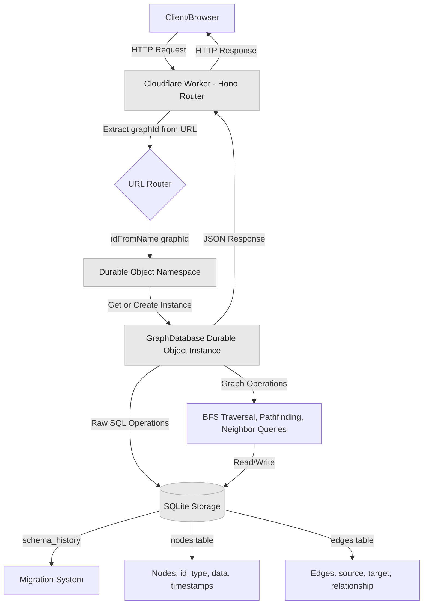
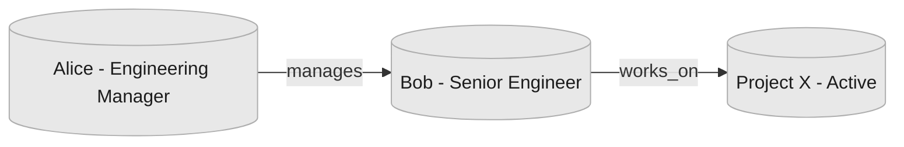
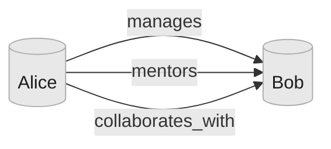
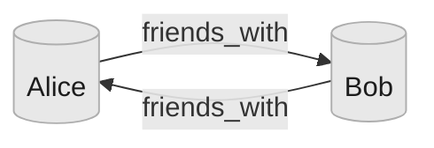
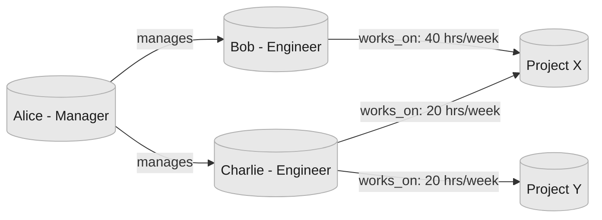
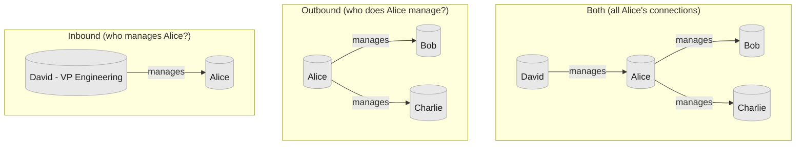
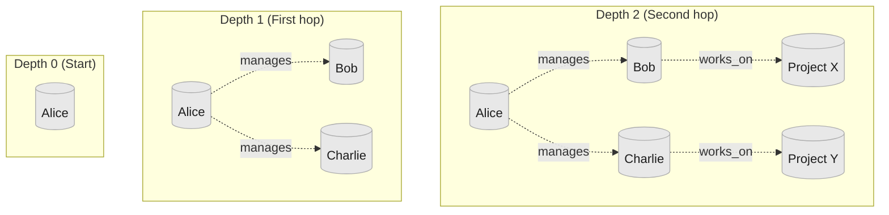
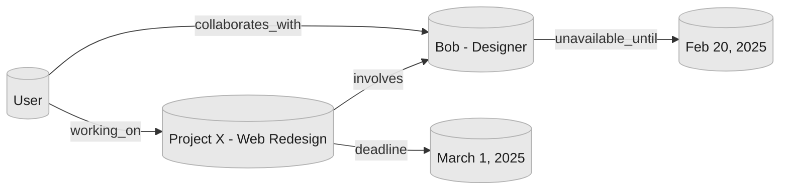

import BlogImage from '../../components/BlogImage.astro';

I found myself needing to create unlimited, isolated graph databases for an AI agent I'm building. I figured an elegant way using [Durable Objects](https://developers.cloudflare.com/durable-objects/) on the [Cloudflare Developers Platform](https://workers.dev). Each graph gets its own instance with dedicated SQLite storage, enabling true multi-tenancy without the complexity of traditional database partitioning.

Traditional graph database deployments require careful infrastructure planning. You need to decide upfront how many database instances to provision, configure connection pooling, implement tenant isolation at the query level, and manage scaling as your user base grows. What if you could skip all of that and let the platform handle it?

In this blog post, I'll walk through building a simple and extensible graph database system leveraging SQLite on Durable Objects where creating a new database is as simple as making an HTTP request with a new identifier. No provisioning, no configuration, just instant isolation.

<BlogImage path="/assets/blog/durable-objects-graph-databases/demo.png" title="Graph database visualisation" id="demo" />

## The Multi-Tenancy Problem

If you're building any kind of multi-tenant application today, you're probably dealing with one of these patterns:

1. **Shared database with tenant IDs**: Every query needs `WHERE tenant_id = ?`
2. **Schema per tenant**: Complex migrations and connection management
3. **Traditional database per tenant**: Infrastructure overhead and cost

The key problem is architectural complexity. When you store multiple tenants in a shared database, you're constantly guarding against data leakage. One missing `WHERE` clause and you've exposed customer data. Likewise, when you create separate databases per tenant, you're managing infrastructure at scale, which usually is resource inefficient.

Graph databases add another layer of complexity. Graph queries naturally traverse relationships, making it even easier to accidentally cross tenant boundaries.

Traditional solutions require:

1. **Careful query design**: Every traversal must check tenant ownership
2. **Complex access control**: Node and edge-level security policies
3. **Performance trade-offs**: Filtering by tenant ID on every hop

What if each tenant could have their own isolated graph database, created automatically on first access?

## Durable Objects as Micro-Databases

[Cloudflare Durable Objects](https://developers.cloudflare.com/durable-objects/) solve this elegantly. Each Durable Object instance is a globally-unique, [strongly-consistent](https://en.wikipedia.org/wiki/Strong_consistency) compute environment with built-in SQLite storage. The key insight: **treat each Durable Object as a complete database instance**.

With Durable Objects, you get:

- **Automatic isolation**: Each instance has its own SQLite database
- **Deterministic routing**: Each `graphId` always routes to the same instance
- **Zero provisioning**: Instances are created on-demand
- **Global distribution**: Automatically deployed to Cloudflare's edge network

This enables a powerful pattern: **one graph database per identifier**.

```typescript
// This is all you need to get an isolated database
const doId = env.GraphDatabase.idFromName("user-123-graph");
const stub = env.GraphDatabase.get(doId);
```

The first time you access `user-123-graph`, Cloudflare creates a new Durable Object instance. The second time, you get the same instance. It's deterministic, isolated, and automatic.

## Project Overview

We'll be using:

- [**Cloudflare Workers**](https://developers.cloudflare.com/workers/) - Serverless HTTP handling and routing
- [**Cloudflare Durable Objects**](https://developers.cloudflare.com/durable-objects/) - Stateful instances with SQLite
- [**Hono**](https://hono.dev/) - Lightweight web framework
- [**TypeScript**](https://www.typescriptlang.org/) - Type-safe development

Here's the basic structure:

```
.
├── bindings.ts           # TypeScript bindings
├── src
│   ├── index.ts         # Worker router and API endpoints
│   ├── do.ts            # Durable Object graph database implementation
│   └── migrate.ts       # Migration system
├── migrations
│   ├── index.ts         # Migration registry
│   └── v00_add_graph_tables.ts  # Initial schema
├── web
│   ├── index.html       # Graph visualization UI
│   ├── app.js           # Frontend application
│   └── style.css        # Styles
├── wrangler.json        # Cloudflare configuration
└── package.json         # Dependencies
```

The architecture looks like this:



The complete source code is available on [GitHub](https://github.com/boristane/cloudflare-dev-101/tree/main/durable-objects-graph-database). I suggest following along with the code for reference.

## Setting Up the Worker

Let's start with the Worker configuration. Create a `wrangler.json` file:

```json
{
  "name": "durable-objects-graph-database",
  "compatibility_date": "2025-10-27",
  "workers_dev": true,
  "main": "./src/index.ts",
  "assets": {
    "directory": "./web",
    "binding": "ASSETS"
  },
  "migrations": [
    {
      "new_sqlite_classes": ["GraphDatabase"],
      "tag": "v1"
    }
  ],
  "durable_objects": {
    "bindings": [
      {
        "name": "GraphDatabase",
        "class_name": "GraphDatabase"
      }
    ]
  }
}
```

The `new_sqlite_classes` migration is crucial. It enables [SQLite storage](https://developers.cloudflare.com/durable-objects/api/sqlite-storage-api/) in your Durable Objects. Without this, your Durable Objects will not have a SQLite database attached.

The [`assets` configuration](https://developers.cloudflare.com/workers/static-assets/) serves a web interface directly from the Worker, enabling us to visualise our graph databases.

## Building the Graph Database Durable Object

The `GraphDatabase` Durable Object implements the graph database. It's a class extending the `DurableObject` class. It encapsulates all graph operations and manages its own SQLite database.

### Schema Design

[Graph databases](https://en.wikipedia.org/wiki/Graph_database) are different from traditional relational databases. Instead of thinking in individual tables with joins, you think in **nodes** (entities) and **edges** (relationships).

#### Understanding Nodes and Edges

Imagine modeling an organization:



**Nodes** are the "things": Alice, Bob, and Project X. Each node has:
- An **ID** (unique identifier)
- A **type** (person, project, document, etc.)
- **Data** (arbitrary JSON properties like name, role, status)

**Edges** are the connections: "Alice manages Bob" and "Bob works on Project X". Each edge has:
- A **source** (where the edge starts)
- A **target** (where the edge ends)
- A **relationship** (what type of connection this is)
- Optional **properties** (metadata about the relationship)

The power comes from traversing these relationships. To answer "what projects does Alice's team work on?", you traverse: Alice → manages → Bob → works_on → Project X.

#### The Schema

Here's how we model this in SQLite:

```sql title="migrations/v00_add_graph_tables.ts"
CREATE TABLE IF NOT EXISTS nodes (
    id TEXT PRIMARY KEY,            -- Unique identifier (e.g., "alice", "project-x")
    type TEXT NOT NULL,             -- Category (e.g., "person", "project")
    data TEXT NOT NULL,             -- JSON blob: {"name": "Alice", "role": "Manager"}
    created_by TEXT NOT NULL,       -- Who created this node
    last_edited_by TEXT NOT NULL,   -- Who last modified it
    updated INTEGER NOT NULL,       -- Last update timestamp (ms since epoch)
    created INTEGER NOT NULL        -- Creation timestamp (ms since epoch)
);

CREATE TABLE IF NOT EXISTS edges (
    source TEXT NOT NULL,           -- Source node ID
    target TEXT NOT NULL,           -- Target node ID
    relationship TEXT NOT NULL,     -- Relationship type (e.g., "manages", "works_on")
    properties TEXT,                -- Optional JSON: {"since": "2024", "hours": 40}
    created_by TEXT NOT NULL,
    last_edited_by TEXT NOT NULL,
    updated INTEGER NOT NULL,
    created INTEGER NOT NULL,
    UNIQUE(source, target, relationship)  -- Prevents duplicate edges
);
```

#### Why This Design Works

**Flexible Node Storage**: The `data` field stores JSON as text. This means different node types can have completely different properties:

```json
// Person node
{"name": "Alice", "role": "Engineering Manager", "email": "alice@example.com"}

// Project node
{"name": "Project X", "status": "active", "deadline": "2025-12-31"}

// Document node
{"title": "Architecture Doc", "url": "https://...", "embedding": [...]}
```

You don't need to alter the schema when adding new node types or properties. Just store different JSON.

**Multi-Relationship Support**: The `UNIQUE(source, target, relationship)` constraint ensures the uniqueness of relationships between nodes, and enables multiple relationship types between the same two nodes:



Alice can simultaneously manage, mentor, and collaborate with Bob. Each is a separate edge with a different `relationship` value.

**Directional Relationships**: Edges have direction. "Alice manages Bob" is different from "Bob manages Alice". The `source` and `target` fields encode this direction:

For bidirectional relationships (like "friends_with"), you create two edges:



**Indexes**: We add indexes to improve query performance:

```sql
CREATE INDEX edges_source_idx ON edges(source);  -- Fast outbound queries
CREATE INDEX edges_target_idx ON edges(target);  -- Fast inbound queries
CREATE INDEX nodes_type_idx ON nodes(type);      -- Filter by node type
```

When you ask "who does Alice manage?", the database uses `edges_source_idx` to quickly find all edges where `source = 'alice'`. Without this index, it would scan a large number of edge. Query performance would tank for large graphs.

Similarly, "who manages Alice?" uses `edges_target_idx` to find edges where `target = 'alice'`.

The `nodes_type_idx` lets you efficiently query "find all person nodes" or "find all projects" without scanning every node.

### Migration System

Durable Object provide a SQLite interface, but it's up to us to figure out a migration system. The database schema will evolve over time as our application evolves. The migration system is **idempotent** and **version-tracked**. Each Durable Object instance maintains its own migration state in a `schema_history` table.

The migration logic:

1. Create `schema_history` table if it doesn't exist
2. Compare current schema version with available migrations
3. Apply any pending migrations in order within a transaction
4. Record each migration in the history table

```typescript title="src/migrate.ts"
export function migrate(storage: DurableObjectStorage, migrations: SQLMigration[]) {
  createSchemaHistory(storage);
  const current = getSchema(storage);
  const toApply = migrations.filter((m) => m.version > (current?.version || -1));

  storage.transactionSync(() => {
    for (const migration of toApply) {
      storage.sql.exec(migration.sql);
      storage.sql.exec(
        "INSERT INTO schema_history (version, name) VALUES (?, ?)",
        migration.version, migration.name
      );
    }
  });
}
```

The [`transactionSync`](https://developers.cloudflare.com/durable-objects/api/sqlite-storage-api/#transactionsync) wrapper ensures atomicity; either all migrations succeed or none do. This prevents corrupted schema states if a migration fails partway through.

The migrations must run in the constructor of the Durable Object class. When a Durable Object receives a request, if it's not yet in memory on the Cloudflare network, it is initialised and the migrations run "just-in-time" for this given instance of the Durable Object class.

### Durable Object Implementation

Now let's implement the `GraphDatabase` class:

```typescript title="src/do.ts"
import { DurableObject } from "cloudflare:workers";
import type { Bindings } from "../bindings";
import { migrations } from "../migrations";
import { migrate } from "./migrate";

export class GraphDatabase extends DurableObject {
  private db: SqlStorage;

  constructor(ctx: DurableObjectState, env: Bindings) {
    super(ctx, env);
    this.db = ctx.storage.sql;

    this.ctx.blockConcurrencyWhile(async () => {
      migrate(ctx.storage, migrations);
    });
  }
}
```

The `blockConcurrencyWhile` ensures migrations complete before any other requests are processed. Without this, you could have race conditions where a request tries to query a table that doesn't exist yet.

### Node Operations

We need operations to create, read, update, and delete nodes. The key node methods in the `GraphDatabase` class are:

- **addNode()**: Creates or updates a node with JSON data stored as text
- **findNode()**: Retrieves a single node by its ID
- **findNodes()**: Lists nodes with optional filtering by type, a limit, and an offset
- **deleteNode()**: Removes a node and cascades to delete all connected edges, ensuring the integrity of the graph

```typescript title="src/do.ts"
addNode(node: InsertNode): Node {
  const { id, type, data, userId } = node;
  const result = this.db.exec(
    "INSERT OR REPLACE INTO nodes (...) VALUES (...) RETURNING *",
    id, type, JSON.stringify(data), userId, userId, Date.now(), Date.now()
  );

  return toNode(result.toArray()[0]);
}

findNode(id: string): Node | null {
  const result = this.db.exec("SELECT * FROM nodes WHERE id = ?", id);
  const res = result.toArray();
  if (!res.length) {
    return null;
  }

  const rows = res as Array<DBNode>;
  const row = rows[0];
  if (!row) return null;

  return toNode(row);
}

findNodes(filters?: { type?: string; limit?: number; offset?: number }): Node[] {
  let query = "SELECT * FROM nodes";
  const params: any[] = [];

  if (filters?.type) {
    query += " WHERE type = ?";
    params.push(filters.type);
  }

  if (filters?.limit) {
    query += " LIMIT ?";
    params.push(filters.limit);
  }

  if (filters?.offset) {
    query += " OFFSET ?";
    params.push(filters.offset);
  }

  const result = this.db.exec(query, ...params);
  const res = result.toArray();

  return res.map((row) => toNode(row as DBNode));
}

deleteNode(id: string): Node | null {
  // First delete all edges connected to this node
  this.db.exec("DELETE FROM edges WHERE source = ? OR target = ?", id, id);

  // Then delete the node
  const result = this.db.exec("DELETE FROM nodes WHERE id = ? RETURNING *", id);
  const res = result.toArray();
  if (!res.length) {
    return null;
  }

  const rows = res as Array<DBNode>;
  const row = rows[0];
  if (!row) return null;

  return toNode(row);
}
```

### Edge Operations

#### How Edges Work

Consider this scenario: you want to model how team members contribute to projects:



Each edge stores:

```typescript
// Bob works on Project X
{
  source: "bob",
  target: "project-x",
  relationship: "works_on",
  properties: { hours_per_week: 40, role: "lead" }
}

// Charlie works on Project X
{
  source: "charlie",
  target: "project-x",
  relationship: "works_on",
  properties: { hours_per_week: 20, role: "contributor" }
}
```

Notice how the same relationship type (`works_on`) can have different properties. This lets you capture nuance, both Bob and Charlie work on Project X, but with different time commitments and roles.

#### The Composite Key Pattern

The `UNIQUE(source, target, relationship)` constraint is fundamental to the design. It means:

- Alice can both "manages" and "mentors" Bob (different relationships)
- Alice can "manages" both Bob and Charlie (different targets)
- Alice "manages" Bob can't be inserted twice (duplicate prevented)

```typescript
// First call: creates the edge
await connectNodes({
  source: "bob",
  target: "project-x",
  relationship: "works_on",
  properties: { hours_per_week: 30 }
});

// Second call: updates the same edge (changes hours from 30 to 40)
await connectNodes({
  source: "bob",
  target: "project-x",
  relationship: "works_on",
  properties: { hours_per_week: 40 }
});
```

#### Edge Methods

The core edge operations are:

**connectNodes()** - Creates or updates an edge:
```typescript
const edge = await stub.connectNodes({
  source: "alice",
  target: "bob",
  relationship: "manages",
  properties: { since: "2024-01-15", team: "engineering" },
  userId: "system"
});
```

**disconnectNodes()** - Removes a specific edge:
```typescript
// Remove the "manages" relationship (other relationships remain)
await stub.disconnectNodes("alice", "bob", "manages");
```

**findEdges()** - Query edges by node or relationship:
```typescript
// Find all edges connected to Bob (any direction)
const bobEdges = await stub.findEdges({ nodeId: "bob" });

// Find all "manages" relationships in the graph
const managesEdges = await stub.findEdges({ relationship: "manages" });
```

#### Edge Properties: When to Use Them

Some relationships are simple facts ("knows", "contains", "references"). Others carry context that's essential to understanding the relationship:

```typescript
// Simple edge - no properties needed
{ source: "doc-1", target: "doc-2", relationship: "references" }

// Rich edge - properties add crucial context
{
  source: "alice",
  target: "project-x",
  relationship: "contributed_to",
  properties: {
    role: "architect",
    startDate: "2024-01-01",
    endDate: "2024-06-30",
    linesOfCode: 15420,
    commits: 247
  }
}
```

The flexibility to add properties without schema changes lets you evolve your data model. You can start with simple edges and enrich them later as you discover what metadata matters.

### Graph Traversal

Graph traversal enables your to explore relationships and answer questions like "how are these two entities connected?" or "what's reachable from this starting point?"

#### Directional Queries

The `findNeighbors()` method finds all nodes directly connected to a given node. Direction matters:



Directional queries are lets you model asymmetric relationships. "Alice manages Bob" is directional, the reverse isn't automatically true.

```typescript title="src/do.ts"
findNeighbors(
  nodeId: string,
  direction: "inbound" | "outbound" | "both" = "both"
): string[] {
  let query: string;
  const params: string[] = [];

  switch (direction) {
    case "inbound":
      query = "SELECT DISTINCT source AS neighbor FROM edges WHERE target = ?";
      params.push(nodeId);
      break;
    case "outbound":
      query = "SELECT DISTINCT target AS neighbor FROM edges WHERE source = ?";
      params.push(nodeId);
      break;
    case "both":
    default:
      query = `
        SELECT DISTINCT target AS neighbor FROM edges WHERE source = ?
        UNION
        SELECT DISTINCT source AS neighbor FROM edges WHERE target = ?
      `;
      params.push(nodeId, nodeId);
      break;
  }

  const result = this.db.exec(query, ...params);
  const res = result.toArray();
  return res.map((row) => (row as { neighbor: string }).neighbor);
}
```

#### Breadth-First Search (BFS)

The `traverse()` method implements [breadth-first search](https://en.wikipedia.org/wiki/Breadth-first_search) to explore the graph layer by layer. BFS guarantees finding the **shortest path** between two nodes.

Here's how BFS explores a graph starting from Alice:



BFS visits all nodes at depth 1 before moving to depth 2. This guarantees the first path found to any node is the shortest.

**Pathfinding Example**: "How is Alice connected to Project X?"
- Depth 0: Start at Alice
- Depth 1: Explore Bob and Charlie (Alice's direct reports)
- Depth 2: Find Project X through Bob
- Result: Alice → manages → Bob → works_on → Project X (2 hops)

Even if there's a longer path (Alice → manages → Charlie → collaborates_with → Bob → works_on → Project X), BFS finds the shorter one first.

The traversal operates in two modes:

1. **Pathfinding Mode** (when `endNodeId` is specified): Find the shortest path from start to end node
2. **Reachability Mode** (when `endNodeId` is omitted): Find all nodes reachable within `maxDepth` hops


```typescript title="src/do.ts"
traverse(startNodeId: string, options = {}) {
  const { endNodeId, maxDepth = 50, direction = "both" } = options;
  const visited = new Set<string>();
  const queue = [{ id: startNodeId, path: [startNodeId], depth: 0 }];

  while (queue.length > 0) {
    const current = queue.shift()!;
    if (current.depth > maxDepth) continue;

    // Pathfinding: stop when target found
    if (endNodeId && current.id === endNodeId) {
      return { found: true, path: current.path, depth: current.depth };
    }

    if (visited.has(current.id)) continue;
    visited.add(current.id);

    // Explore neighbors
    const neighbors = this.findNeighbors(current.id, direction);
    for (const neighborId of neighbors) {
      if (!visited.has(neighborId)) {
        queue.push({
          id: neighborId,
          path: [...current.path, neighborId],
          depth: current.depth + 1,
        });
      }
    }
  }

  // Reachability: return all visited nodes
  return { found: true, reachableNodes: Array.from(visited), count: visited.size };
}
```

In a highly connected graph (think social networks where most people are connected within 6 degrees), an unbounded traversal could visit the entire graph. By limiting depth through `maxDepth`, you can explore local neighborhoods without scanning millions of nodes.

The algorithm maintains a `visited` set to avoid cycles. Without this, you could loop indefinitely in a graph with circular references (A → B → C → A).

## Building the HTTP API

Now let's expose these operations through an HTTP API. We'll use Hono for routing:

```typescript title="src/index.ts"
import { Hono } from "hono";
import { cors } from "hono/cors";
import type { Bindings } from "../bindings";

const app = new Hono<{ Bindings: Bindings }>();

app.use("/*", cors());

export default {
  async fetch(request: Request, env: Bindings, ctx: ExecutionContext): Promise<Response> {
    const url = new URL(request.url);

    if (url.pathname.startsWith("/api/")) {
      const apiRequest = new Request(request.url.replace("/api", ""), request);
      return app.fetch(apiRequest, env, ctx);
    }

    return env.ASSETS.fetch(request);
  },
};

export { GraphDatabase } from "./do";

function getGraphDatabaseStub(env: Bindings, graphId: string) {
  const doId = env.GraphDatabase.idFromName(graphId);
  return env.GraphDatabase.get(doId);
}
```

The routing is clean: `/api/*` goes to our Hono app, everything else is served from static assets for a simple web interface to visualise the graph.

The `getGraphDatabaseStub` function uses [`idFromName(graphId)`](https://developers.cloudflare.com/durable-objects/api/namespace/#idfromname) to get a unique ID from the graphId, and creates a [stub](https://developers.cloudflare.com/durable-objects/api/namespace/#get) which can be used to invoke methods on the associated Durable Object. This is the foundation of the multi-tenancy model:

- Same input (`"user-123-graph"`) → Same Durable Object ID → Same instance
- Different input (`"user-456-graph"`) → Different ID → Different instance
- No coordination needed; the `idFromName` guarantees deterministic routing

You don't need a lookup table mapping tenant IDs to Durable Object IDs.

### API Endpoints

Every endpoint extracts `graphId` from the URL path, making multi-tenancy explicit in the URL structure:

```
/api/alice-graph/nodes      # Alice's graph
/api/bob-graph/nodes        # Bob's graph
/api/project-x/nodes        # Project X's graph
```

**Node Operations:**
- `POST /:graphId/nodes` - Create or update a node
- `GET /:graphId/nodes/:nodeId` - Retrieve a specific node
- `GET /:graphId/nodes?type=&limit=&offset=` - List nodes with filtering
- `DELETE /:graphId/nodes/:nodeId` - Delete node and connected edges

**Edge Operations:**
- `POST /:graphId/edges` - Create an edge between nodes
- `GET /:graphId/edges?nodeId=&relationship=` - Find edges by node or relationship
- `DELETE /:graphId/edges/:source/:relationship/:target` - Remove a specific edge

**Graph Operations:**
- `GET /:graphId/nodes/:nodeId/neighbors?direction=` - Find adjacent nodes
- `POST /:graphId/traverse` - Execute BFS pathfinding or reachability analysis
- `GET /:graphId/stats` - Get graph metrics (node count, edge count, type distributions)

Each endpoint follows the same pattern: extract the `graphId`, get the Durable Object stub, call the method, return JSON.

```typescript title="src/index.ts"
app.post("/:graphId/nodes", async (c) => {
  const graphId = c.req.param("graphId");
  const body = await c.req.json<InsertNode>();
  const stub = getGraphDatabaseStub(c.env, graphId);
  const node = await stub.addNode(body);
  return c.json({ node });
});
```

No shared tables, no tenant ID columns in queries. Different graphs queries are routed to different Durable Object instances.

## Interactive Graph Visualization

I also vibe-coded a simple UI to visualise the state of the graph, hosted on the same Worker as the HTTP API.

## Testing It Out

Let's deploy and test our graph database using [Wrangler](https://developers.cloudflare.com/workers/wrangler/):

```bash
npm run deploy
```

Wrangler will build your TypeScript code, upload it to Cloudflare, and output your Worker URL:

```
https://durable-objects-graph-database.your-account.workers.dev
```

### Creating a Knowledge Graph

Let's build a simple organizational graph with people and projects:

```bash
# Create person nodes (Alice, Bob)
curl -X POST https://your-worker.workers.dev/api/my-org/nodes \
  -H "Content-Type: application/json" \
  -d '{
    "id": "alice",
    "type": "person",
    "data": {"name": "Alice", "role": "Engineering Manager"},
    "userId": "system"
  }'

curl -X POST https://your-worker.workers.dev/api/my-org/nodes \
  -H "Content-Type: application/json" \
  -d '{
    "id": "bob",
    "type": "person",
    "data": {"name": "Bob", "role": "Senior Engineer"},
    "userId": "system"
  }'

# Create a project node
curl -X POST https://your-worker.workers.dev/api/my-org/nodes \
  -H "Content-Type: application/json" \
  -d '{
    "id": "project-x",
    "type": "project",
    "data": {"name": "Project X", "status": "active"},
    "userId": "system"
  }'

# Add relationships: Alice manages Bob, Bob works on Project X
curl -X POST https://your-worker.workers.dev/api/my-org/edges \
  -H "Content-Type: application/json" \
  -d '{
    "source": "alice",
    "target": "bob",
    "relationship": "manages",
    "userId": "system"
  }'

curl -X POST https://your-worker.workers.dev/api/my-org/edges \
  -H "Content-Type: application/json" \
  -d '{
    "source": "bob",
    "target": "project-x",
    "relationship": "works_on",
    "properties": {"hours_per_week": 40},
    "userId": "system"
  }'
```

### Querying the Graph

Now let's explore the graph:

```bash
# Find everyone Alice manages
curl https://your-worker.workers.dev/api/my-org/nodes/alice/neighbors?direction=outbound

# Response:
# {
#   "neighbors": ["bob"],
#   "count": 1
# }

# Find who's working on Project X
curl https://your-worker.workers.dev/api/my-org/nodes/project-x/neighbors?direction=inbound

# Response:
# {
#   "neighbors": ["bob"],
#   "count": 1
# }

# Find the path from Alice to Project X
curl -X POST https://your-worker.workers.dev/api/my-org/traverse \
  -H "Content-Type: application/json" \
  -d '{
    "startNodeId": "alice",
    "endNodeId": "project-x",
    "maxDepth": 5
  }'

# Response:
# {
#   "found": true,
#   "path": ["alice", "bob", "project-x"],
#   "depth": 2
# }
```

The traversal found a path: Alice → Bob → Project X. This shows the connection between a manager and a project through the people she manages.

### Multi-Tenancy in Action

Creating multiple graphs is as simple as making HTTP calls:

```bash
# Create a node in Alice's personal graph
curl -X POST https://your-worker.workers.dev/api/alice-personal/nodes \
  -H "Content-Type: application/json" \
  -d '{
    "id": "note-1",
    "type": "note",
    "data": {"content": "Remember to review PRs"},
    "userId": "alice"
  }'

# Create a node in the company graph
curl -X POST https://your-worker.workers.dev/api/company-wide/nodes \
  -H "Content-Type: application/json" \
  -d '{
    "id": "policy-1",
    "type": "policy",
    "data": {"title": "Remote Work Policy"},
    "userId": "hr"
  }'
```

These are completely isolated. A query on "alice-personal" will never see "company-wide" data. Each has its own Durable Object instance with its own SQLite database.

## Use Cases

I'm particularly interested in AI agent uses cases.

### AI Agent Memory

AI agents need persistent memory to build context over time and understand complex relationships. Traditional approaches use vector databases for semantic search, but graph databases excel at representing how concepts, entities, and conversations interconnect.

#### The Problem with Context-Only Memory

When an AI agent remembers only through vector similarity, it loses the **structure** of relationships. Consider this scenario:

An AI assistant named Alice helps a user with their work. Over multiple conversations, the user mentions:
- They're working on "Project X" (a web app)
- They're collaborating with "Bob" (the designer)
- "Project X" has a deadline of March 1st
- Bob is on vacation until February 20th

A vector database might retrieve "Bob" when the user asks about the deadline, but it can't easily answer "Who on my team is available to help before the deadline?" That requires understanding the relationships: Project X → has_deadline → March 1st, Project X → involves → Bob, Bob → unavailable_until → February 20th.

#### Graph-Based Agent Memory

With a graph database, each agent builds a knowledge graph that captures not just facts, but how they relate:



Here's how the agent builds this knowledge over time:

```typescript
// Conversation 1: User mentions they're working on a project
await fetch('/api/agent-alice/nodes', {
  method: 'POST',
  body: JSON.stringify({
    id: 'project-x',
    type: 'project',
    data: { name: 'Web Redesign', status: 'in_progress' },
    userId: 'agent-alice'
  })
});

await fetch('/api/agent-alice/edges', {
  method: 'POST',
  body: JSON.stringify({
    source: 'user',
    target: 'project-x',
    relationship: 'working_on',
    userId: 'agent-alice'
  })
});

// Conversation 2: User mentions Bob is helping with design
await fetch('/api/agent-alice/nodes', {
  method: 'POST',
  body: JSON.stringify({
    id: 'bob',
    type: 'person',
    data: { name: 'Bob', role: 'Designer' },
    userId: 'agent-alice'
  })
});

await fetch('/api/agent-alice/edges', {
  method: 'POST',
  body: JSON.stringify({
    source: 'project-x',
    target: 'bob',
    relationship: 'involves',
    userId: 'agent-alice'
  })
});

// Conversation 3: User mentions Bob's vacation
await fetch('/api/agent-alice/edges', {
  method: 'POST',
  body: JSON.stringify({
    source: 'bob',
    target: 'unavailable-period',
    relationship: 'unavailable_until',
    properties: { date: '2025-02-20' },
    userId: 'agent-alice'
  })
});
```

Now when the user asks "Is my team available to help me finish before the deadline?", the agent can traverse the graph:

```typescript
// Start from the user, explore their projects and collaborators
const context = await fetch('/api/agent-alice/traverse', {
  method: 'POST',
  body: JSON.stringify({
    startNodeId: 'user',
    maxDepth: 3,  // Explore up to 3 hops away
    direction: 'both'
  })
});

// Returns: User → Project X → Bob → Unavailable Until Feb 20
// Agent can reason: "Bob won't be available until Feb 20, but your deadline is March 1,
// so you'll have 9 days to work together"
```

#### Why This Works

Each agent gets its own graph (`/api/agent-alice/`, `/api/agent-bob/`). As the agent has more conversations, the graph grows organically:

- **Conversations** link to **Topics** they discuss
- **Topics** link to **Projects**, **People**, **Deadlines**
- **Projects** link to **Tasks**, **Documents**, **Decisions**
- **People** link to **Skills**, **Availability**, **Preferences**

The graph becomes a structure memory layer that captures not just what the agent knows, but how concepts interconnect. When recalling context, traversal provides the most relevant connected information, not just similar words, but structurally related concepts.

### Graph-RAG Systems

Retrieval-Augmented Generation (RAG) enhances LLMs by providing relevant context from external knowledge bases. Graph-based RAG goes beyond simple vector similarity by modeling relationships between documents, entities, and concepts. Store document chunks and their relationships for more intelligent retrieval. 

## Limitations and Considerations

While this pattern is powerful, there are important limitations to understand:

1. **Scale per Graph**: Each Durable Object instance is limited to 10 GB, as such is best suited for graphs with thousands to tens of thousands of nodes. For larger graphs, consider sharding.

2. **Cross-Graph Queries**: You can't easily query across multiple graphs. Each Durable Object is isolated. If you need to aggregate data from multiple tenants, you'll need to query each graph individually.

3. **Cold Start Latency**: The first request to a new Durable Object has some initialization overhead. For frequently accessed graphs this isn't an issue, but rarely-used graphs might experience slightly higher latency on first access.

4. **Global Consistency**: Durable Objects provide strong consistency within a single instance but don't offer distributed transactions across instances. If you need atomicity across multiple graphs, you'll need to implement your own coordination.

5. **Backup and Export**: There's no built-in backup system. For production use, you'll want to implement periodic exports of graph data to durable storage like [Cloudflare R2](https://developers.cloudflare.com/r2/).

## What's Next

This foundation enables many extensions:

- **Full-Text Search**: Add [SQLite FTS5](https://www.sqlite.org/fts5.html) virtual tables for text search within node and edge properties

- **Complex nested queries**: Add the ability to run more complex queries on the JSON data of nodes and edges using [SQLite json_tree](https://sqlite.org/json1.html#jtree) functions

- **Graph Algorithms**: Implement [PageRank](https://en.wikipedia.org/wiki/PageRank), [community detection](https://en.wikipedia.org/wiki/Community_structure), or [centrality metrics](https://en.wikipedia.org/wiki/Centrality) for graph analysis

- **Graph Embeddings**: Store vector embeddings on nodes using [Cloudflare Vectorize](https://developers.cloudflare.com/vectorize/) for hybrid graph + semantic similarity search

- **Batch Operations**: Add endpoints for bulk node/edge creation and updates to improve performance for large imports

The complete source code with a visualization UI is available on [GitHub](https://github.com/boristane/cloudflare-dev-101/tree/main/durable-objects-graph-database). Fork it and build something interesting.

## Conclusion

Durable Objects flip the traditional database model on its head. Instead of managing infrastructure and partitioning data, you create instances on demand. Each instance is a complete, isolated database with its own storage and compute.

With SQLite storage, migrations, and proper schema design, each instance becomes a fully-featured database that happens to run at the edge.

This pattern works for graphs, but it generalizes to any domain where you need isolated per-tenant data stores. Document databases, time-series data, etc; the architecture is the same.
