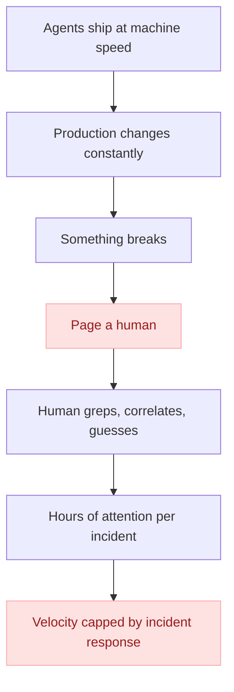
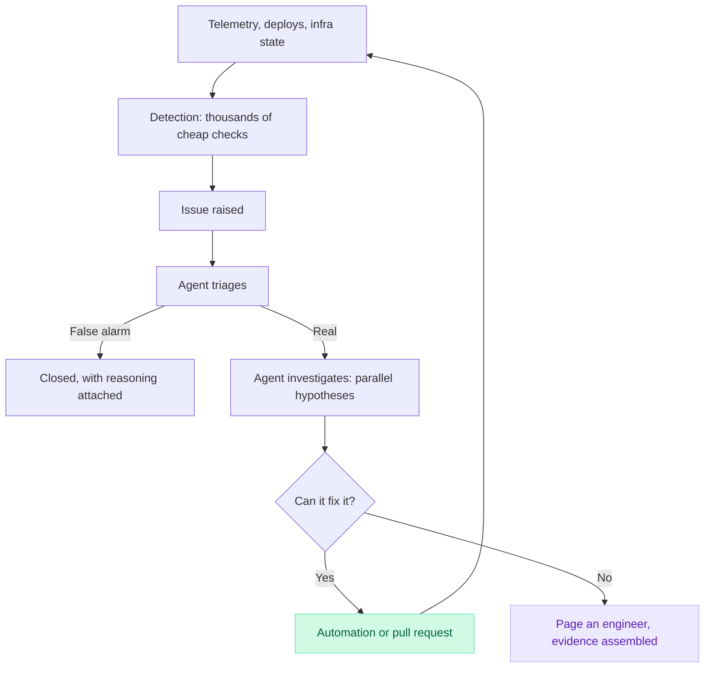

import BlogImage from '../../components/BlogImage.astro';

Your on-call rotation has always been an admission of defeat. Every alert threshold, every escalation policy, every runbook is the same admission written in YAML: software cannot be trusted to run in production, so somebody must be strapped to it at all times.

But today agents write most of the code. Engineers spend their time designing, prompting, reviewing, and creating loops to continuously produce more and more software. 

Building software has been transformed beyond recognition in under three years. Operating it hasn't moved an inch. The rotation, the pager, the dashboards, the rituals: all exactly where we left them, guarding a world that no longer exists.

## We've all lived through terrible on-call rotations

You get paged when you're having dinner on a beautiful Saturday. You log in, ask your agent what's up, open four dashboards, cross-reference a deploy timeline, and six "what the heck is this?" later, you conclude it's probably not that big of a deal. You ack the alert and go back to your now-cold meal.

Nothing about that page actually needed *you*. It needed someone who could pull up telemetry, reason about it, and decide nothing was on fire. For the entire history of software, that someone had to be a person. Everything about how we run production is downstream of that one fact.

## The core issue: everything was calibrated to human attention

Everything about on-call and observability is built around one core principle: human attention is a scarce resource.

Every alert threshold is tuned around the cost of waking up an engineer. We have always treated alert fatigue as if it was a bug in the system we could fix with better alert thresholds or SLOs. But alert fatigue *is* the system: a rationing mechanism for eyeballs.

Metrics exist to compress millions of datapoints into something a human can absorb in a glance. Runbooks exist to digest the knowledge of an expert in the system into a document anyone can follow. The on-call rotation itself exists to distribute suffering across a team.

When the only thing that can investigate an incident is an engineer, you design everything (thresholds, tooling, org charts, etc.) around protecting and rationing human attention.

That fundamental constraint is now obsolete.

## And yet, we're still doing it

You already let agents write the vast majority of your code. Your team probably ships dozens of PRs a day; I've seen teams where a single engineer ships 10+ PRs a day. We've industrialised the production of software with "software factories".

But we're still responsible for ensuring all this software runs in production, equipped with dozens of MCPs and poorly written skills. We automated the cause and kept the cure handmade.  

The teams sprinting ahead with coding agents are quietly discovering that their velocity is capped not by how fast they can build, but by how fast a human can figure out what broke.

Every gain in build velocity converts directly into operational debt, until PagerDuty wins and the shipping stops.

Self-operating software is the next frontier for software engineering.

## Self-operating software

We need software that watches itself, triages its own alerts, investigates its own incidents, fixes what it can, and escalates to a human only when it hits something genuinely novel, with the evidence already assembled.

<BlogImage path="/assets/blog/on-call-is-now-theatre/paging-an-agent.png" title="Steve Faulkner (Cloudflare) on agents and on-call" id="paging-an-agent" />

Put your AI agents in the worst on-call rotation imaginable, then give them a tool to page a human. Developers stop being the first responder, and step in only when an agent genuinely cannot figure something out.

This flips the economics of what to monitor. Your thresholds are conservative because paging an engineer is expensive. If paging has near-zero marginal cost, you don't want fewer alerts, you want *dramatically more*. You borderline want your agent to read every single log line and figure out all errors and unexpected paths in real-time, as requests are flowing through your systems. Monitor the p99 that crept up 3%, the queue depth that's slightly off its weekly pattern, the error rate that's fine but different. All the weak signals you convinced yourself are not worth monitoring usually turn into pages when it's too late.

A friend at a lab put it extremely clearly to me recently:

> "It feels like it's going to become a non-negotiable to have harnesses programmatically access cell data, alerts, metrics, traces and logs with full support. Investigations and operations are night and day when these things are exposed."

The same shift that happened to code generation is happening to incident response: engineers move from doing the work to judging the work.

The loop looks like this:

However, none of this works if the agent can't see. Self-operating software needs programmatic access to everything a senior engineer would look at during an incident: metrics, logs, traces, alerts, SLOs, deploy history, infra state, service ownership, the code itself, and, critically, how all of it connects in a single operations graph. Without it, every investigation dead-ends in a Slack message that reads "something looks off", forcing an engineer to start digging again.

## The loop closes with a pull request

A triage that ends in a Slack summary is merely a nicely formatted prompt to an engineer. Agents should not prompt us.

The only valid output of an investigation is a diff. When the system traces an incident to its cause, it should write the fix and open the pull request itself, with the entire causal chain attached, receipts included, so every claim can be audited.

The agent should tell you: here's what broke, here's the evidence, here's the fix, here's why it's safe. Your job is to say yes or no. Judgement, not archaeology.

<BlogImage path="/assets/blog/on-call-is-now-theatre/why-we-opened-this.png" title="An autofix pull request explaining why it was opened" id="why-we-opened-this" />

## The first line of defense moves to the pull request

And the loop must run backwards too. The cheapest incident is the one that never ships. The system must interrogate every change *before it merges*.

Every pull request should trigger the same machinery as an incident, pointed forwards instead of backwards. The agent reads the diff and forms multiple hypotheses about how the change could hurt production. Does this migration lock a table with live writes? Does this touch a delivery path that's serving traffic right now? Does deploy ordering matter here? What did that dependency bump actually change, and how old is the release? Then it tries to confirm or refute each hypothesis against the real system: live telemetry, actual deploy topology, the current shape of traffic.

An agent can test every hypothesis, on every change, every time, and never gets tired of it. The best investigation is the one that ends before the incident begins.

<BlogImage path="/assets/blog/on-call-is-now-theatre/production-impact-unlikely.png" title="A change analysed for production impact before it merges" id="production-impact-unlikely" />

## Most teams won't do this

What's preventing most teams from fully embracing this way of working is trust. Letting an agent triage production incidents feels reckless the same way agents pushing PRs felt reckless twelve months ago. This trust requires admitting that the rotation, the thresholds, the dashboards, things we have built our identities around, were just rationing mechanisms for scarce attention. That attention is now abundant, and we have intelligence sometimes too cheap to meter. That's an uncomfortable thing to admit about an expertise built over years. It was just as uncomfortable when it was writing code not too long ago.

Most teams will take the easy route: an AI summary at the top of the PagerDuty incident, a chatbot in the incident channel, MCPs on engineers' laptops, and call it "transformation". The ritual survives, an engineer still wakes up, still triages, still wrangles MCPs. The theatre gets slightly better lighting.

The teams that actually invert the rotation will look reckless right up until they look inevitable. They'll run thousands of checks where you run fifty. They'll catch the 3% regression you'd have noticed in next quarter's cloud bill. Their engineers will sleep, and spend their attention on problems a machine genuinely cannot crack yet.

## Start this week

You don't need to buy anything or rearchitect anything to start.

1. Pick your noisiest alert, the one everyone acks without reading.
2. Point it at a cloud agent.
3. Give the agent read access to your observability tool. Logs, metrics, the deploy timeline.
4. Every time it fires, have the agent post its triage to Slack before any engineer looks at it.
5. For two weeks, compare. Count how many times you concluded anything the agent didn't.

Now imagine an agent coming up with alerts, analysing the hidden paths in your codebase, continuously updating its understanding of production with specialised tools, and fixing issues before they become problems.

Software that writes itself was the first half. Software that operates itself is what's ahead of us. And most of the industry is still arguing about whether we should read code or not.
