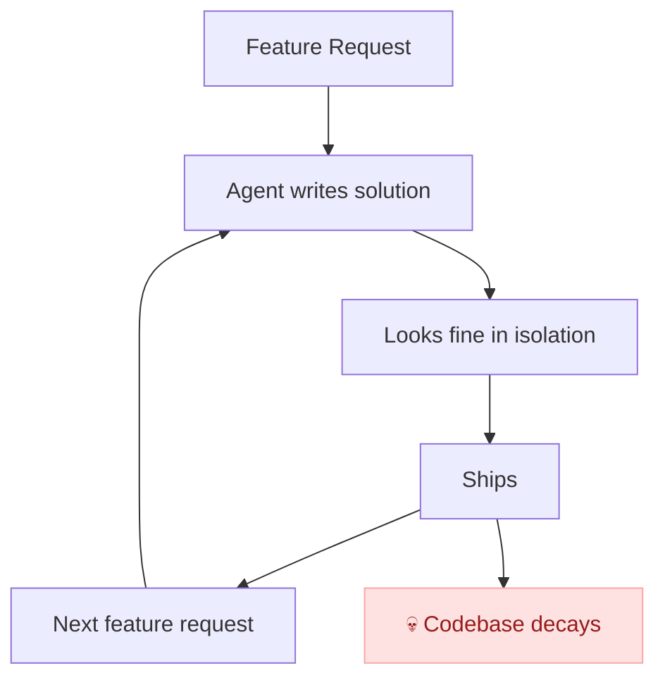
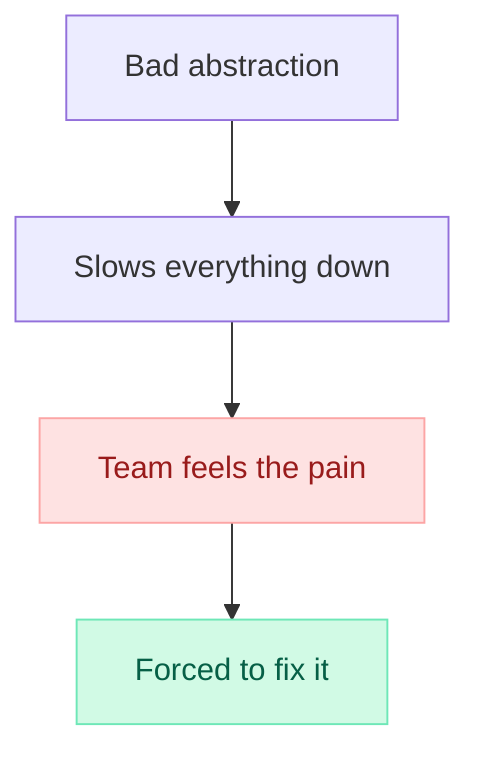
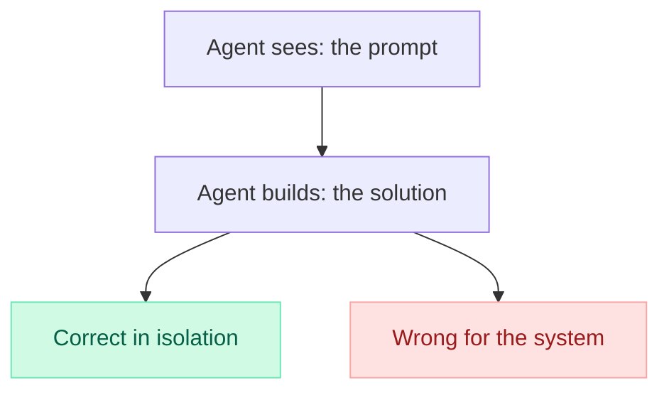
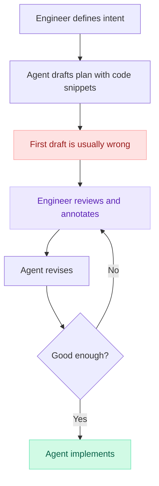
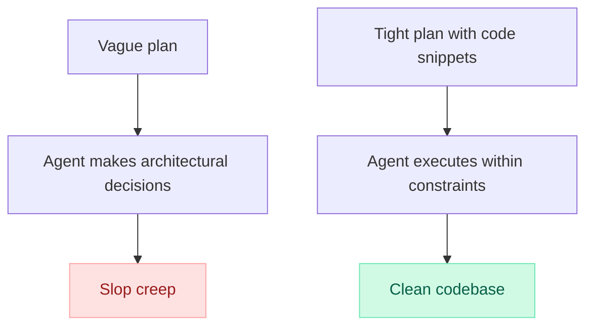
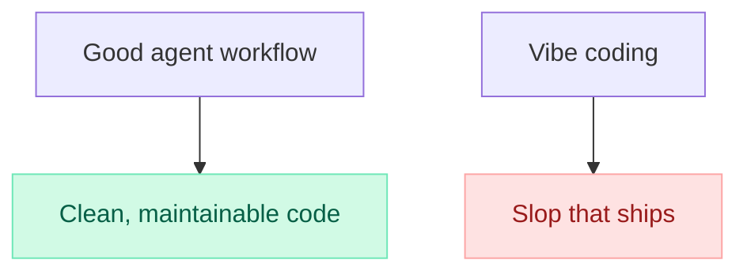

import BlogImage from '../../components/BlogImage.astro';

Slop creep is the slow, invisible enshittification of a codebase through an accumulation of individually reasonable but collectively destructive decisions, each one too small to flag, too numerous to track, and too deeply buried to unwind by the time you notice.

Picture a codebase six months from now. Every feature shipped on time, every PR passed review. But the team is slower than ever, and constantly firefighting.

Every new feature touches 10s of files. There are six different ways to do the same thing. The data models have fields that exist purely to work around a limitation that was introduced earlier and never revisited. The on-call rotation is a nightmare because nobody can trace the flow of a request through the system anymore.

I've done this to myself. When building [Baselime](https://baselime.io), I made every mistake in the books: premature microservices, poor and impossible to extend schemas, leaky abstraction, etc. I shipped fast, made "pragmatic" architectural calls, and watched the codebase calcify around them. That used to take months of compounding mistakes to reach crisis point.

Last year I got a coding agent, and my side project reached crisis point in days.

## Every change is fine, but the codebase is not

This is the insidious thing about slop creep. No single commit is the problem. The agent didn't introduce a bug, it introduced a slightly wrong abstraction, then built on top of it, then built on top of *that*.

Two weeks later, unwinding it means fiddling with databases in production and rewriting three services. That's slop creep: death by a thousand reasonable decisions.

## The old world had a circuit breaker

Bad architectural decisions used to come one at the time. A junior developer with bad instincts had a natural speed limit: they couldn't build fast enough to bury the codebase before someone noticed. The pain was loud and unavoidable, so you fixed it or you died.

Coding agents removed the circuit breaker.

The agent can keep piling crap on top of more crap, indefinitely, and stay productive the entire time. You don't slow down. You build a bigger pile. The reckoning is deferred, compounded, and much more painful when it finally arrives.

## Coding agents can't think about systems holistically

The core problem is simple: coding agents are not able to find the right level of abstraction when building software. They don't see the system, they see the prompt.

Ask an agent to add an endpoint and it adds an endpoint. It doesn't know there are four other endpoints that should have been abstracted into a shared handler, or that the data model it's extending was already a mistake. It doesn't know any of that because no one told it.

The agent is confidently, competently wrong. You must specifically tell it the important decisions in your codebase.

### Will this get better?

Maybe. Context windows are growing, models are getting smarter, and the answer is probably more context. The agent that can read the entire codebase, understand the history of every decision, and anticipate where the system is heading in six months will make far fewer wrong calls.

But today's agents don't do that. They see the prompt, the files they're told to read, and nothing else. They have no foresight about where the system needs to go, and no memory of how it got here. Until that changes, the gap between "correct in isolation" and "right for the system" is yours to fill.

## The agent should fill the gaps, not make the calls

A coding agent can turn a 10x engineer into a 100x engineer, but that doesn't mean the engineer disappears. It means the engineer stops typing and **starts thinking**.

It's unfortunate we're collectively using these tools very wrong. Outputting slop daily, turning our brains off because the computer "can do our job for us".

Data models, service boundaries, key abstractions, etc. These are one-way doors, decisions that are hard or impossible to reverse once they're in production. The agent should never be the one walking through a one-way door alone. That's where you come in.

This doesn't mean you dictate every schema and interface upfront. The agent's first draft of a plan is a starting point, and it's usually terrible. Wrong cardinality, missing constraints, boolean fields where you need an enum, no thought given to how the data will be queried six months from now. But that first draft is incredibly useful as something to react to. You read it, tear it apart, annotate it with corrections, and send the agent back to revise. After two or three rounds of this, you end up with abstractions that are better than what either of you would have produced alone, because you're combining the agent's breadth of knowledge with your understanding of the system and the product.

I wrote about [how I use Claude Code](/blog/how-i-use-claude-code) with a research-plan-implement workflow built around exactly this kind of iterative refinement.

I don't write code anymore, but I read pretty much every single line my agent writes. Every time I have let the agent loose without a tight plan, I have regretted it a couple of weeks later, always the same things: bad database schemas, boolean fields everywhere, lack of analytics, and don't get me started on observability.

## The answer is not to stop using agents

Slop creep is real, but it is not a reason to stop using coding agents. They're the best thing that has happened to software development in years, and I can now build things I didn't know I had in me to build. I have no intention of going back to typing every character of my codebase myself.

But the planning phase deserves ten times more attention than most people give it. Not a vague description of the feature. Actual code snippets for the key data models. Actual interfaces for the key abstractions. Enough that the agent can't get the important stuff wrong, because there's no ambiguity left to fill with slop.

Spend more time in the plan. Write the code snippets for the decisions that matter. Then let the agent cook.

## "Code is the new assembly"

There's a popular counterargument: none of this matters. Code is the new assembly language. Nobody reads it. The agent writes it, the tests pass, the feature works, who cares if the internals are ugly?

This misunderstands what a compiler does. The role of a compiler is to translate higher-level languages into **efficient, performant** machine code. A compiler that produced bloated, redundant, subtly incorrect machine code would not be used by anyone serious about building software.

If your agent is the compiler, and the output is slop, you don't have a compiler. You have a liability.

And the enshittification doesn't stay in the code, it spills into the user experience. Every vibe-coded app has the same telltale signs, a plethora of tiny cuts that make the whole thing feel *off*:

- An app that hogs all the available resources on your computer
- A button that doesn't quite disable when it should
- A loading state that flickers
- A form that loses your input on navigation
- An error message that says "something went wrong" because nobody modelled the failure modes

None of these show up in a demo. All of them are bugs your users feel every single day. Slop creep in the codebase becomes slop creep in the product, and your users will not read your code to figure out why the experience is bad. They'll just leave.

## The job has changed, not disappeared

Honestly, everything in this post could be obsolete with the next major model release. An agent that truly understands systems holistically, that has the foresight to see where a codebase is heading and the context to know why it got here, would change the equation entirely.

But that's not what we have today. And in the next 6 to 12 months, the engineer who makes the difference is the one who can look at an agent's output and say "this is wrong for reasons you can't see from where you're standing." The one who knows which doors are one-way, which abstractions will calcify, and which corners will cost you later.

Until the models catch up, fight slop creep. The enshittification of software is quiet, entirely preventable, and happening everywhere right now.
