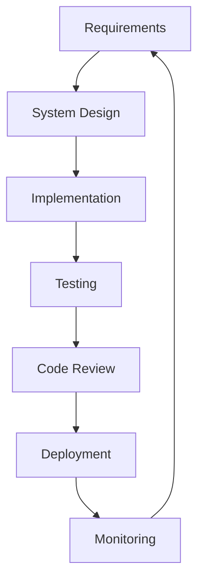
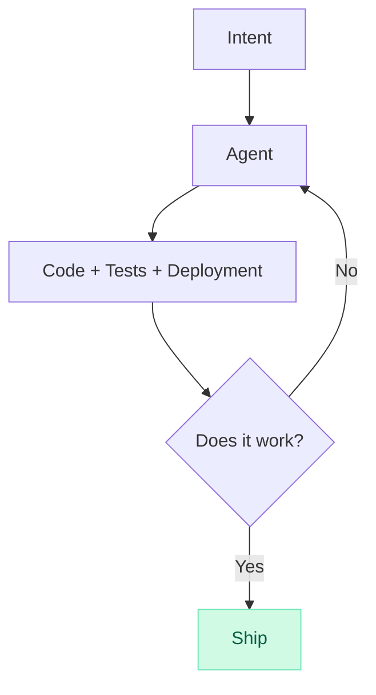
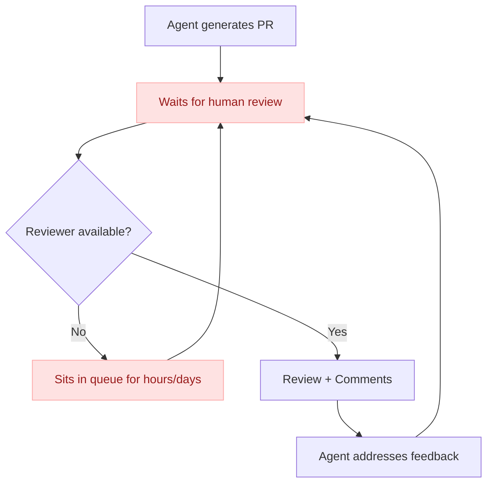
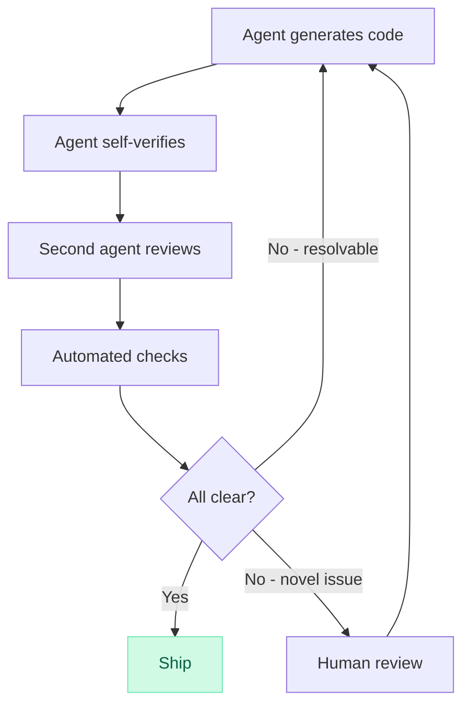
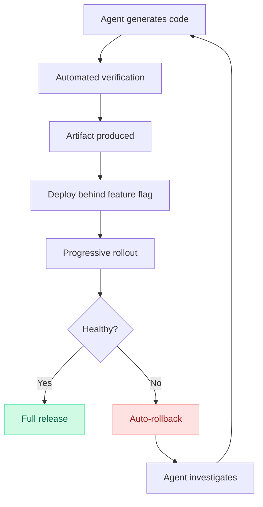
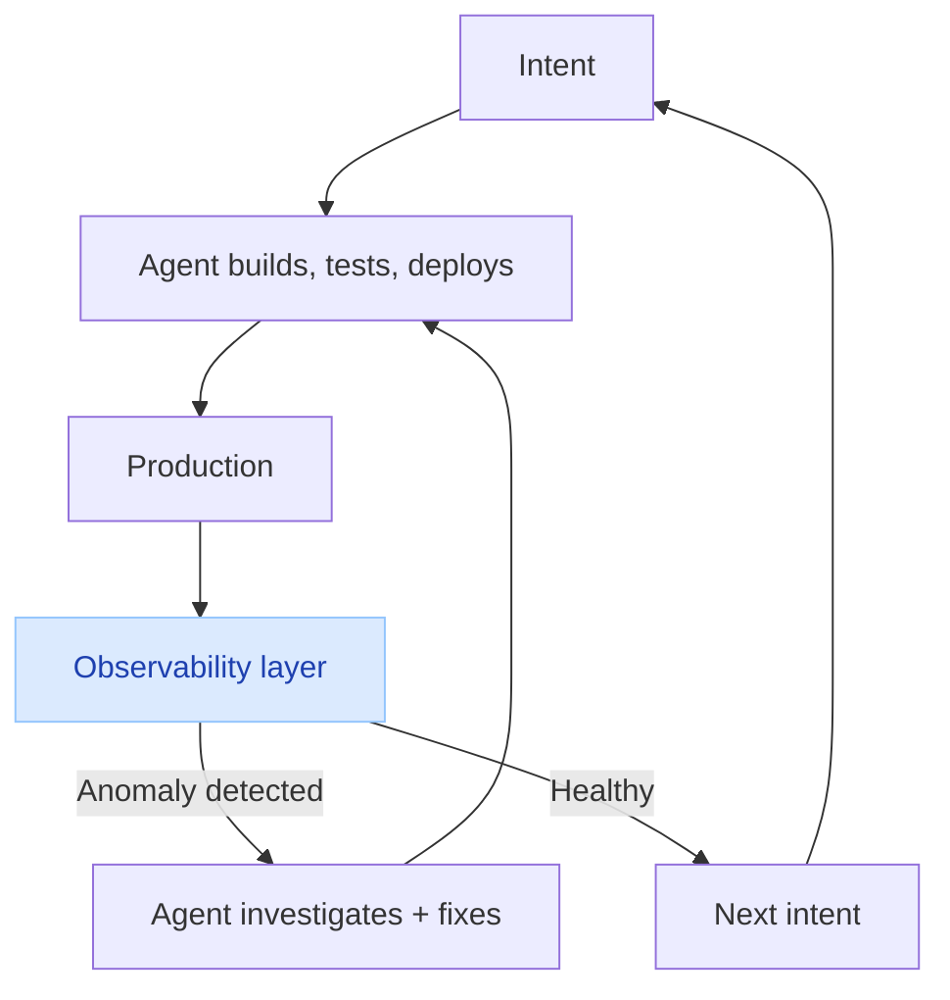
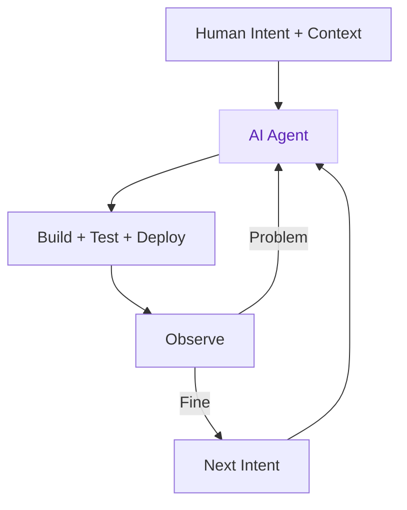

AI agents didn't make the SDLC faster. They killed it.

I keep hearing people talk about AI as a "10x developer tool." That framing is wrong. It assumes the workflow stays the same and the speed goes up. That's not what's happening. The entire lifecycle, the one we've built careers around, the one that spawned a multi-billion dollar tooling industry, is collapsing in on itself.

And most people haven't noticed yet.

## The SDLC you learned is a relic

Here's the classic software development lifecycle most of us were taught:

Every stage has its own tools, its own rituals, its own cottage industry. Jira for requirements. Figma for design. VS Code for implementation. Jest for testing. GitHub for code review. AWS for deployment. Datadog for monitoring.

Each step is discrete. Sequential. Handoffs everywhere.

Now here's what actually happens when an engineer works with a coding agent:

The stages collapsed. They didn't get faster. They merged. The agent doesn't know what step it's on because there are no steps. There's just intent, context, and iteration.

## AI-native engineers don't know what the SDLC is

I spent a lot of time speaking with engineers who started their career after Cursor launched. They don't know what the software development lifecycle is. They don't know what's DevOps or what's an SRE. Not because they're bad engineers. Because they never needed it. They've never sat through sprint planning. They've never estimated story points. They've never waited three days for a PR review.

They just build things.

You describe what you want. The agent writes the code. You look at it. You iterate. You ship. Everything simultaneously.

These engineers aren't worse for skipping the ceremony. They're unencumbered by it. Sprint planning, code review workflows, release trains, estimation rituals. None of it. They skipped the entire orthodoxy and went straight to building.

And honestly? I'm jealous.

## Every stage is collapsing

Let me walk through the SDLC and show you what's left of it.

### Requirements gathering: fluid, not dictated

Requirements used to be handed down. A PM writes a PRD, engineers estimate it, and the spec gets frozen before a line of code is written. That made sense when building was expensive. When every feature took weeks, you had to decide upfront what to build.

That constraint is gone. When an agent can generate a complete version of a feature in minutes, you don't need to specify every detail in advance. You provide the direction, the agent builds a version, you look at it, you adjust, you try a different approach. You can generate ten versions and pick the best one. Requirements aren't a phase anymore. They're a byproduct of iteration.

Now, what is Jira when the audience isn't humans coordinating across a pipeline? What is Jira when it's agents consuming context? Jira was built to track work through stages that no longer exist. If your "requirements" are just context for an agent, then the ticketing system isn't a project management tool anymore. It's a context store. And it's a terrible one.

### System Design: discovered, not dictated

System design still matters. But the way it happens is fundamentally shifting.

Design used to be something you did before writing code. You'd whiteboard the architecture, debate trade-offs, draw boxes and arrows, then go implement it. The gap between the design and the code was days or weeks.

That gap is closing. Design is becoming something you discover by giving the agent the right context, not something you dictate ahead of time. The model has seen more systems, more architectures, more patterns than any individual engineer. When you describe a problem, the agent doesn't just implement your design, it suggests architectures that are often superior to what you'd have come up with on your own. You're having a design conversation in real-time, and the output is working code.

You still need to know when an agent is over-engineering or missing a constraint. But you're collaborating on design, not prescribing it.

### Implementation: this is the agent's job now

This one is obvious. The agent writes the code. Whole features. Complete solutions with error handling, types, edge cases.

I don't personally know anyone who still types lines of code. We review what agents write, feed them context, steer direction, and focus on the problems that actually require human judgment.

### Testing: simultaneous, not sequential

Agents write tests alongside the code. Not as an afterthought. Not in a separate "testing phase." The test is part of the generation. TDD isn't a methodology anymore, it's just how agents work by default.

The entire QA function as a separate stage is gone. When code and tests are generated together, verified together, and iterated together, there's no handoff. No "throw it over the wall to QA.". The agent can do the QA itself.

### Code review: give it up

The pull request flow needs to go. I was never a fan, but now it's just a relic of the past.

I know that's uncomfortable. Code review is sacred. It's how you catch bugs, share knowledge, maintain standards. It's also an identity thing. We're *engineers*, and reviewing code is what engineers do. But clinging to the PR workflow in an agent-driven world isn't rigor. It's an identity crisis.

Think about it. An agent generates 500 PRs a day. Your team can review maybe 10. The review queue backs up. This isn't a bottleneck worth optimising. It's a fake bottleneck, one that only exists because we're forcing a human ritual onto a machine workflow.

This diagram shouldn't exist. The entire flow is wrong.

The review has to be rethought from scratch. Either it becomes part of the code generation itself, the agent verifies its own work against the plan document, runs the tests, checks for regressions, validates against architectural constraints, or a second agent reviews the first agent's output. Adversarial agents plough through the proposed changes, try to break it in every dimension. We already have the tools for this. Human-in-the-loop review becomes exception-based, triggered only when automated verification can't resolve a conflict or when the change touches something genuinely novel.

What does a world without pull requests look like? Agents commit to main. Automated checks, tests, type checks, security scans, behavioral diffs, validate the change. If everything passes, it ships, automatically. If something fails, the agent fixes it. A human only gets involved when the system genuinely doesn't know what to do.

We're spending our review cycles reading diffs that an agent could verify in seconds. That's not quality assurance. That's luddism.

### Deployment: decoupled and continuous

Agents are already writing deployment pipelines that are more intricate and more specialised than what most teams would ever bother building by hand. Feature flags, canary releases, progressive rollouts, automatic rollback triggers, the kind of release engineering that used to require a dedicated platform team.

The key shift is that agents naturally decouple deployment from release. Code gets deployed continuously, every change, as soon as it's generated and verified, produces an artifact that lands in production behind a gate. Release is a separate decision, driven by feature flags or traffic rules.

Some teams are already approaching true continuous deployment and release. Code is generated, tests pass, artifacts are built, and the change is live, all in a single automated flow with no human in the loop between intent and production.

Where this goes next is even more interesting. Imagine agents that don't just deploy code but manage the entire release lifecycle, monitoring the rollout, adjusting traffic percentages based on error rates, automatically rolling back if latency spikes, and only notifying a human when something genuinely novel goes wrong. The deployment "stage" doesn't just get automated. It becomes an ongoing, self-adjusting process that never really ends.

### Monitoring: the last stage standing, and it needs to evolve

Monitoring is the only stage of the SDLC that survives. And it doesn't just survive, it becomes the foundation everything else rests on.

When agents ship code faster than humans can review it, observability is no longer a nice-to-have dashboarding layer. It's the primary safety mechanism for the entire collapsed lifecycle. Every other safeguard, the design review, the code review, the QA phase, the release sign-off, has been absorbed or eliminated. Monitoring is what's left. It's the last line of defense.

But most observability platforms were built for humans. Alerts, log search, dashboard, etc. all designed for a person to look at, interpret, and act on. That model breaks when the volume of changes outpaces human attention. If an agent ships 500 changes a day and your observability setup requires a human to investigate each anomaly, you've created a new bottleneck. You've just moved it from code review to incident response.

Observability without action is just expensive storage. The future of observability isn't dashboards, it's closed-loop systems where telemetry data becomes context for the agent that shipped the code, so it can detect the regression and fix it.

**The observability layer becomes the feedback mechanism that drives the entire loop.** Not a stage at the end. The connective tissue of the whole system.

The teams that figure this out first, observability that feeds directly back into the agent loop, not into a human's pager, will ship faster and safer than everyone else. The teams that don't will drown in alerts.

## The new lifecycle is tighter loop

The SDLC was a wide loop. Requirements → Design → Code → Test → Review → Deploy → Monitor. Linear. Sequential. Full of handoffs and waiting.

The new lifecycle is a tight loop.

Intent. Build. Observe. Repeat.

No tickets. No sprints. No story points. No PRs sitting in a queue. No separate QA phase. No release trains.

Just a human with intent and an agent that executes.

## So what is left?

Context. That's it.

The quality of what you build with agents is directly proportional to the quality of context you give them. Not the process. Not the ceremony. The context.

The SDLC is dead. The new skill is context engineering. The new safety net is observability.

And most of the industry is still configuring Datadog dashboards no one looks at.
