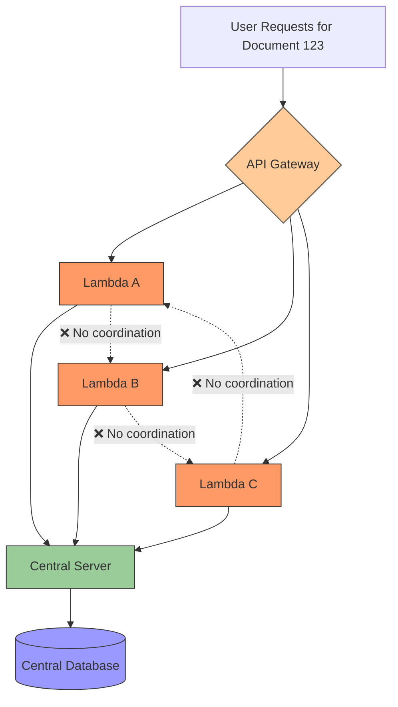
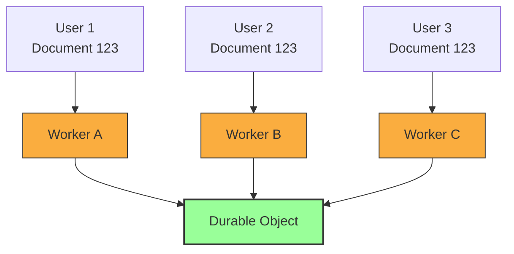
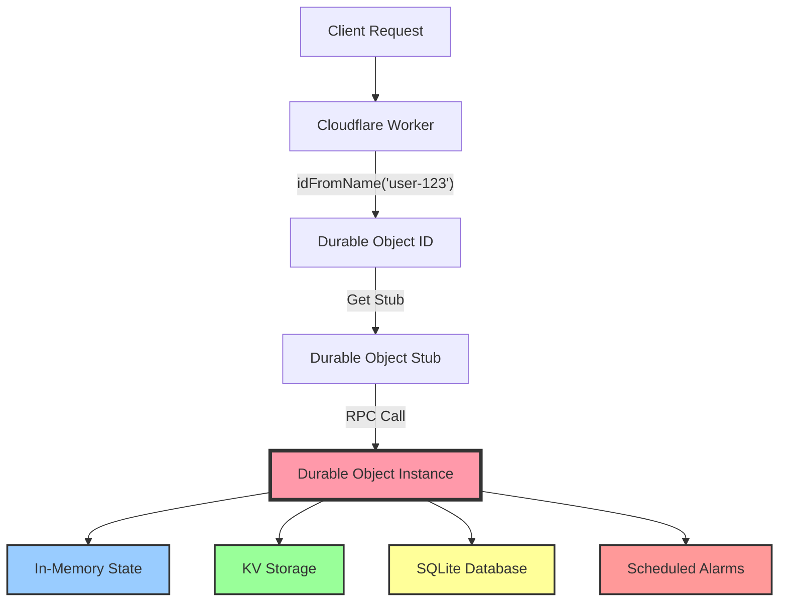
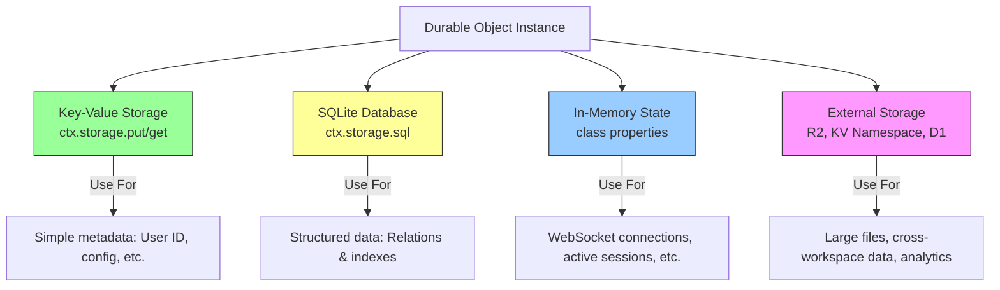

import BlogImage from '../../components/BlogImage.astro';


Two years ago I was just like you. I had heard of [Cloudflare Durable Objects](https://workers.cloudflare.com/product/durable-objects), I read the docs, but still had no idea what these were. Today I almost exclusively build with Durable Objects (DOs), and I can't imagine building production applications without them. Let me explain what finally made it click for me.

## The Problem: State in Serverless

You know how regular serverless functions (like [AWS Lambda Functions](https://aws.amazon.com/lambda/)) are stateless? Every request starts fresh, with no memory of what happened before. If you want to remember something between requests, you have to store it in a database.

This works fine for most CRUD operations.

But it quickly becomes a real challenge when you need to:

- Handle WebSocket connections that stay open for minutes or hours
- Coordinate multiple requests to the same resource (like when 10 people are editing the same document simultaneously)
- Run scheduled tasks for a specific user (like sending a subscription renewal reminder exactly 30 days after signup)

The traditional solution? Spin up a stateful server. But now you're back to managing servers, dealing with scaling, load balancing, and paying for idle capacity.



Durable Objects give you the benefits of stateful servers (long-lived connections, state, coordination) without the operational overhead. They're serverless, but stateful. They scale automatically, but maintain strong consistency. They're ephemeral (shutting down when idle), but durable (state persists).



## My "Aha!" Moment: One Instance per ID

Here's the key insight that made it click for me:

> A Durable Object is like having a tiny, long-lived server that is **guaranteed to be unique** for a specific ID.

When you create a Durable Object with [`idFromName("workspace-123")`](https://developers.cloudflare.com/durable-objects/api/namespace/#idfromname), Cloudflare ensures that **only one instance** of that object exists globally. Every request with that same ID goes to the **exact same instance**, no matter where in the world the request comes from.

This is fundamentally different from regular [Cloudflare Workers](https://workers.cloudflare.com/product/workers). With Workers, if 100 requests come in for "workspace-123", they might be handled by 100 different Worker instances across 100 different data centers, depending on the origating request. Each instance is isolated, stateless, and ephemeral.

With Durable Objects, all 100 requests for "workspace-123" are routed to the **same single instance** of your Durable Object. That instance can be running in Tokyo, and requests from New York will be routed there. This single instance can maintain WebSocket connections, coordinate concurrent access, and act as the single source of truth for that workspace's state.

It's like having a dedicated micro-server for each user, workspace, or chat room. Except you only pay when it's actually being used, and you never have to think about deployment, scaling, or geographic distribution.

## Explain Like I'm 5

Imagine a library (Cloudflare's edge network) with millions of private study rooms (Durable Objects). Each room has:
- A **unique room number** (the ID)
- A **desk with drawers** (persistent storage)
- A **person working inside** (your code)
- A **whiteboard** (in-memory state)

When you want to access "Room 123", the librarian always sends you to the same room. The person inside remembers what they were doing, has access to their drawers (storage), and can handle your request immediately.

If nobody visits the room for a while, the person leaves (hibernation), but their drawers stay locked. When someone comes to visit the same room again, the person returns exactly where they left off.

## How Requests Flow



## Creating a Durable Object

Let's build a simple "Workspace" Durable Object, based on patterns from real production code:

```typescript
// workspace.ts - The Durable Object class
export class DurableWorkspace extends DurableObject {
  private sql: SqlStorage;

  constructor(ctx: DurableObjectState, env: Env) {
    super(ctx, env);
    this.sql = ctx.storage.sql;

    // Run migrations on first access
    ctx.blockConcurrencyWhile(async () => {
      await this.migrate();
    });
  }

  async migrate() {
    // Create tables if they don't exist
    this.sql.exec(`
      CREATE TABLE IF NOT EXISTS projects (
        id TEXT PRIMARY KEY,
        name TEXT NOT NULL,
        created INTEGER NOT NULL
      )
    `);
  }

  // Store workspace identity
  async init(workspaceId: string, ownerId: string) {
    await this.ctx.storage.put("workspaceId", workspaceId);
    await this.ctx.storage.put("ownerId", ownerId);

    // Schedule a monthly cleanup
    await this.ctx.storage.setAlarm(Date.now() + 30 * 24 * 60 * 60 * 1000);
  }

  async getWorkspaceId(): Promise<string> {
    return await this.ctx.storage.get("workspaceId") || "";
  }

  async createProject(name: string) {
    const id = crypto.randomUUID();
    this.sql.exec(
      "INSERT INTO projects (id, name, created) VALUES (?, ?, ?)",
      id,
      name,
      Date.now()
    );
    return { id, name };
  }

  async listProjects() {
    const result = this.sql.exec("SELECT * FROM projects ORDER BY created DESC");
    return result.toArray();
  }

  // Called when alarm triggers
  async alarm() {
    console.log("Running monthly cleanup...");
    // Clean up old data
    this.sql.exec("DELETE FROM projects WHERE created < ?", Date.now() - 90 * 24 * 60 * 60 * 1000);

    // Schedule next cleanup
    await this.ctx.storage.setAlarm(Date.now() + 30 * 24 * 60 * 60 * 1000);
  }
}
```

## Accessing the Durable Object: The Stub Pattern

Now that we've seen a Durable Object class, how do we actually use it? You don't instantiate Durable Objects directly. Instead, you get a "stub" - a proxy that lets you call methods on the Durable Object from your Worker.

The critical part is the `idFromName()` call. This is what ensures you always get the same instance for the same ID. Think of it like a phone book - you look up "workspace-123" in the directory, and Cloudflare gives you a direct line to that workspace's unique Durable Object instance, wherever it happens to be running in the world.

Here's how you access your Durable Object from a Worker:

```typescript
// Helper function to get a workspace stub
export function getWorkspaceStub(env: Env, workspaceId: string): DurableObjectStub<DurableWorkspace> {
  // idFromName ensures the same ID always goes to the same instance
  const id = env.WORKSPACE.idFromName(workspaceId);
  const stub = env.WORKSPACE.get(id);
  return stub;
}

// In your Worker (API endpoint)
export default {
  async fetch(request: Request, env: Env) {
    const url = new URL(request.url);
    const workspaceId = url.searchParams.get("workspace");

    // Get the stub - always the same instance for this workspace
    const workspace = getWorkspaceStub(env, workspaceId);

    if (url.pathname === "/init") {
      await workspace.init(workspaceId, "user-123");
      return new Response("Initialized");
    }

    if (url.pathname === "/projects") {
      if (request.method === "POST") {
        const { name } = await request.json();
        const project = await workspace.createProject(name);
        return Response.json(project);
      } else {
        const projects = await workspace.listProjects();
        return Response.json(projects);
      }
    }

    return new Response("Not found", { status: 404 });
  }
};
```

The Worker acts as a router - it extracts the workspace ID from the request, gets the appropriate Durable Object stub using `idFromName()`, and calls methods on it.

The `workspace.createProject()` and `workspace.listProjects()` calls are [RPC (Remote Procedure Calls)](https://developers.cloudflare.com/workers/runtime-apis/rpc/) - they're executed inside the Durable Object instance, not in the Worker. The Worker just forwards the request and gets the response back.

## The Four Storage Layers

One of the most powerful aspects of Durable Objects is having multiple storage options. When I first started, I didn't understand why you'd need so many ways to store data. But each layer serves a distinct purpose and has different performance characteristics.

Think of it like this: in-memory state is your desk (fast, temporary), KV storage is your desk drawer (fast, persistent, small items), SQLite is your filing cabinet (structured, queryable, medium size), and external storage like R2 is your warehouse (massive, slower, for big things).

Understanding when to use each storage layer is crucial:



### Example: Using All Storage Layers

```typescript
export class ChatRoom extends DurableObject {
  // In-memory: active WebSocket connections
  private connections: Map<string, WebSocket> = new Map();

  // In-memory: temporary message buffer
  private messageBuffer: Message[] = [];

  constructor(ctx: DurableObjectState, env: Env) {
    super(ctx, env);

    ctx.blockConcurrencyWhile(async () => {
       // SQLite: create messages table
      this.ctx.storage.sql.exec(`
        CREATE TABLE IF NOT EXISTS messages (
          id TEXT PRIMARY KEY,
          userId TEXT NOT NULL,
          content TEXT NOT NULL,
          timestamp INTEGER NOT NULL
        );
        CREATE INDEX IF NOT EXISTS idx_timestamp ON messages(timestamp);
      `);
    });
  }

  async initRoom(roomId: string, roomName: string) {
    // Key-Value: store simple metadata
    await this.ctx.storage.put("roomId", roomId);
    await this.ctx.storage.put("roomName", roomName);
    await this.ctx.storage.put("createdAt", Date.now());
  }

  async handleWebSocket(request: Request): Promise<Response> {
    const pair = new WebSocketPair();
    const [client, server] = Object.values(pair);

    // In-memory: track active connection
    const connectionId = crypto.randomUUID();
    this.connections.set(connectionId, server);

    server.addEventListener("message", async (event) => {
      const message = JSON.parse(event.data);
      // In-memory: save message to the buffer
      this.messageBuffer.push(message)

      // SQLite: persist message
      this.ctx.storage.sql.exec(
        "INSERT INTO messages (id, userId, content, timestamp) VALUES (?, ?, ?, ?)",
        crypto.randomUUID(),
        message.userId,
        message.content,
        Date.now()
      );

      // In-memory: broadcast to all active connections
      for (const [id, conn] of this.connections) {
        if (id !== connectionId) {
          conn.send(JSON.stringify(message));
        }
      }

      // External: save to R2 for archival
      if (this.messageBuffer.length >= 100) {
        await this.archiveMessages();
      }
    });

    server.addEventListener("close", () => {
      this.connections.delete(connectionId);
    });

    server.accept();
    return new Response(null, { status: 101, webSocket: client });
  }

  async archiveMessages() {
    const roomId = await this.ctx.storage.get("roomId");
    const messages = this.messageBuffer.splice(0);

    // External storage: R2 bucket for large archives
    await this.env.ARCHIVE_BUCKET.put(
      `rooms/${roomId}/${Date.now()}.json`,
      JSON.stringify(messages)
    );
  }

  async getRecentMessages(limit: number = 50) {
    // SQLite: efficient queries with indexes
    const result = this.ctx.storage.sql.exec(
      "SELECT * FROM messages ORDER BY timestamp DESC LIMIT ?",
      limit
    );
    return result.toArray();
  }
}
```

## Real-World Pattern: Parent-Child Relationships

This is my favourite pattern when building multitenant applications. Let me explain it with a real-world analogy first, then show you the code.

### The Apartment Building Analogy

Imagine you're building a project management SaaS app. Think of it like an apartment building:

- **The Building (Workspace)** is a Durable Object that represents the entire workspace
- **Each Apartment (Project)** is its own separate Durable Object
- **The Building Manager** keeps a directory of all apartments (the workspace's SQLite database)
- **Each Apartment** has its own furniture, residents, and state (the project's data and tasks)

Why separate them? Because if you put all apartments' furniture in the building manager's office, it gets crowded fast. Instead, each apartment manages its own internal state, but the building manager knows about all apartments and can coordinate between them.

In code terms: **don't put all your data in one Durable Object**. Create separate child Durable Objects for each logical entity (user, project, document, chat room), and have a parent Durable Object that coordinates them.

### Why This Pattern Matters

The thing is, each Durable Object is single-threaded. If you have one giant Durable Object handling everything for a workspace with 100 projects, and 50 users are all editing different projects simultaneously, they're all waiting in line for that one Durable Object to process their requests.

But if each project is its own Durable Object, those 50 users can work in parallel across 50 different Durable Objects. The parent workspace just maintains a registry of which projects exist.


```typescript
// Parent: DurableWorkspace
export class DurableWorkspace extends DurableObject {
  async createThread(threadName: string) {
    const threadId = crypto.randomUUID();
    const workspaceId = await this.ctx.storage.get("workspaceId");

    // Store reference in parent's database
    this.ctx.storage.sql.exec(
      "INSERT INTO threads (id, name, created) VALUES (?, ?, ?)",
      threadId,
      threadName,
      Date.now()
    );

    // Get stub to child Durable Object
    const threadStub = getThreadStub(this.env, threadId);

    // Initialize the child
    await threadStub.init(threadId, workspaceId, threadName);

    return { id: threadId, name: threadName };
  }

  async listThreads() {
    const result = this.ctx.storage.sql.exec(
      "SELECT * FROM threads ORDER BY created DESC"
    );
    return result.toArray();
  }
}

// Child: DurableThread
export class DurableThread extends DurableObject {
  async init(threadId: string, workspaceId: string, threadName: string) {
    // Store parent reference
    await this.ctx.storage.put("threadId", threadId);
    await this.ctx.storage.put("workspaceId", workspaceId);
    await this.ctx.storage.put("threadName", threadName);
  }

  async addMessage(content: string) {
    const id = crypto.randomUUID();
    this.ctx.storage.sql.exec(
      "INSERT INTO messages (id, content, created) VALUES (?, ?, ?)",
      id,
      content,
      Date.now()
    );
    return { id, content };
  }

  async deleteThread() {
    const workspaceId = await this.ctx.storage.get("workspaceId");
    const threadId = await this.ctx.storage.get("threadId");

    // Tell parent to remove reference
    const workspaceStub = getWorkspaceStub(this.env, workspaceId);
    await workspaceStub.deleteThreadReference(threadId);

    // Clean up own data
    this.ctx.storage.sql.exec("DELETE FROM messages");
    await this.ctx.storage.deleteAll();
  }
}

// Helper functions
function getThreadStub(env: Env, threadId: string) {
  const id = env.THREAD.idFromName(threadId);
  return env.THREAD.get(id);
}

function getWorkspaceStub(env: Env, workspaceId: string) {
  const id = env.WORKSPACE.idFromName(workspaceId);
  return env.WORKSPACE.get(id);
}
```

### What's Happening Here?

Let's walk through the flow when a user creates a thread:

1. **User calls API**: "Create a thread named 'Q4 Planning' in workspace-123"
2. **Worker gets workspace stub**: Uses `idFromName("workspace-123")` to get the workspace Durable Object
3. **Workspace creates reference**: Stores "thread-456, Q4 Planning" in its own SQLite database
4. **Workspace spawns child**: Gets a stub to a new Thread Durable Object using `idFromName("thread-456")`
5. **Child initializes**: The thread stores its identity (threadId, workspaceId, name)
6. **Now they're connected**: The workspace knows about the thread, and the thread knows about its parent workspace

Later, when listing threads:
- You ask the workspace: "What threads exist?"
- It queries its own database and returns the list
- You don't need to wake up every thread Durable Object just to list them

When adding a message:
- You go directly to the thread Durable Object
- It handles the message independently
- The workspace doesn't need to be involved at all

This separation means the workspace can track hundreds of threads without getting bogged down by message operations, and threads can process messages in parallel without waiting for the workspace.

## Scheduled Operations with Alarms

Here's another outstanding feature that took me a while to appreciate: each Durable Object can schedule its own future work. Not through some external scheduler, but built right into the object itself.

Think about subscription renewals. With traditional serverless, you'd need:
1. A cron job that runs every hour
2. It queries your database for all subscriptions expiring in the next hour
3. It processes each one
4. This gets expensive and slow as you scale to millions of users

With Durable Objects + Alarms:
1. When a user subscribes, their Subscription Durable Object schedules an alarm for exactly 30 days from now
2. In 30 days, that specific Durable Object wakes up automatically
3. It processes just that user's renewal
4. Then schedules the next alarm

No cron jobs scanning millions of records. No batch processing. Just-in-time execution for each user. This is incredibly powerful for per-user or per-entity scheduled tasks.

Here's how it works in code:

```typescript
export class SubscriptionManager extends DurableObject {
  async createSubscription(userId: string, planType: string) {
    await this.ctx.storage.put("userId", userId);
    await this.ctx.storage.put("planType", planType);
    await this.ctx.storage.put("status", "active");

    // Schedule renewal check in 30 days
    const renewalDate = Date.now() + 30 * 24 * 60 * 60 * 1000;
    await this.ctx.storage.setAlarm(renewalDate);
  }

  async alarm() {
    const userId = await this.ctx.storage.get("userId");
    const planType = await this.ctx.storage.get("planType");

    console.log(`Processing renewal for user ${userId}`);

    // Charge the user
    const success = await this.chargeUser(userId, planType);

    if (success) {
      // Schedule next renewal
      await this.ctx.storage.setAlarm(Date.now() + 30 * 24 * 60 * 60 * 1000);
    } else {
      // Downgrade to free plan
      await this.ctx.storage.put("status", "expired");
      await this.ctx.storage.put("planType", "free");
    }
  }

  async cancelSubscription() {
    await this.ctx.storage.put("status", "cancelled");

    // Cancel future alarms
    await this.ctx.storage.deleteAlarm();
  }

  private async chargeUser(userId: string, planType: string): Promise<boolean> {
    // Call payment API
    return true;
  }
}
```

## When Should You Use Durable Objects?

Here's my mini-decision framework:

**Perfect for Durable Objects:**
- Per-user/per-tenant databases
- AI agents
- Real-time collaboration (Google Docs-style editing)
- WebSocket servers (chat rooms, live dashboards)
- Coordinating multiple requests to the same resource
- Rate limiting per user
- Session management
- Scheduled tasks per entity (user notifications, subscription renewals)

**Not ideal for Durable Objects:**
- Storing large blobs (use [R2](https://workers.cloudflare.com/product/r2) instead)
- Analytics aggregation across many users ([Workers Analytics Engine](https://developers.cloudflare.com/analytics/analytics-engine/))
- Truly stateless operations (use regular [Workers](https://workers.cloudflare.com/product/workers))
- Queries across all users (use [D1](https://workers.cloudflare.com/product/d1) with proper indexes)

**Be careful with:**
- Very high traffic to a single ID (DOs are single-threaded per instance)
- Long-running CPU-intensive tasks (use queues + regular workers instead)

## Common Pitfalls I Learned the Hard Way

Let me save you from the mistakes I made when I was learning Durable Objects. These gotchas aren't obvious from the docs, but they'll bite you in production if you're not careful.

### 1. Don't Forget: One Instance = One Thread

This is the biggest gotcha. A Durable Object instance is single-threaded. Every request to the same ID is processed sequentially, one at a time. This is actually a feature (strong consistency!), but it means you can't block for long periods.

I once had a Durable Object that called a slow external API and took 5 seconds to respond. When 10 requests came in simultaneously for the same object, the last request waited 50 seconds. Not good.

```typescript
// BAD: Blocking operation will freeze this DO for everyone
export class BadExample extends DurableObject {
  async handleRequest() {
    // This blocks for 10 seconds - ALL requests wait!
    await new Promise(resolve => setTimeout(resolve, 10000));
    return "Done";
  }
}

// GOOD: Offload heavy work to queues
export class GoodExample extends DurableObject {
  async handleRequest() {
    // Queue the work, return immediately
    await this.env.QUEUE.send({ task: "heavy-work" });
    return "Queued";
  }
}
```

### 2. Initialize the Durable Object identity

When a Durable Object is first created, its storage is empty. It's not possible to recall the name of the Durable Object from within the Durable Object. You need to explicitly initialize it. I use an `init()` method.


```typescript
// BAD: Storage might be empty on first call
export class BadExample extends DurableObject {
  async getWorkspaceId() {
    return await this.ctx.storage.get("workspaceId"); // Could be undefined!
  }
}

// GOOD: Explicit initialization
export class GoodExample extends DurableObject {
  async init(workspaceId: string) {
    await this.ctx.storage.put("workspaceId", workspaceId);
  }

  async getWorkspaceId() {
    const id = await this.ctx.storage.get("workspaceId");
    if (!id) throw new Error("Workspace not initialized - call init() first");
    return id;
  }
}
```

## The Key to Real-Time Apps and AI Agents: Hibernate API

Before [Hibernate API](https://developers.cloudflare.com/workers/platform/changelog/#2023-05-26), if you had a chat room with 1000 connected users but nobody was sending messages, you were still paying for that Durable Object to stay alive and hold those connections.

With Hibernate API, the Durable Object can "hibernate" - essentially go to sleep while maintaining WebSocket connections. When a message arrives, it wakes up automatically, handles the message, and can go back to sleep.

The beauty is that this happens transparently. Your code doesn't change. You just get automatic cost savings and better resource utilization.

```typescript
export class ChatRoom extends DurableObject {
  // Hibernate API automatically serializes/deserializes state
  async webSocketMessage(ws: WebSocket, message: string) {
    const data = JSON.parse(message);

    // Broadcast to all connections
    this.ctx.getWebSockets().forEach(socket => {
      socket.send(JSON.stringify(data));
    });
  }

  async webSocketClose(ws: WebSocket, code: number, reason: string) {
    console.log("disconnected");
  }

  async handleConnect(request: Request): Promise<Response> {
    const pair = new WebSocketPair();
    const [client, server] = Object.values(pair);

    // Attach metadata to the WebSocket
    this.ctx.acceptWebSocket(server);

    return new Response(null, { status: 101, webSocket: client });
  }
}
```

With Hibernate API, your Durable Object can go to sleep when idle (saving you money) and wake up automatically when a WebSocket message arrives. The state is automatically preserved!

## Leveling Up: The Cloudflare Agents SDK

<BlogImage path="/assets/blog/what-are-cloudflare-durable-objects/npm-install-agents.svg" id="npm-install-agents" />

The Cloudflare [`agents` SDK](https://agents.cloudflare.com/) ([`npm i agents`](https://www.npmjs.com/package/agents)) is a framework built on top of Durable Objects. It's designed for building AI agents on the Cloudflare network, and has become my default framework when building with Durable Objects.

**You don't need to be building AI agents to use it.** Despite the name, it's actually a general-purpose framework for building stateful real-time applications with Durable Objects. It just happens to make AI agent development really easy too.

### What Does the Agents SDK Give You?

The `Agent` base class (which you saw earlier when I showed you the `Neuron` class extending it) provides:

1. **WebSocket handling out of the box** - `onConnect()`, `onMessage()`, `onClose()` lifecycle methods
2. **HTTP request handling** - `onRequest()` method with clean routing
3. **Email routing** - Built-in email address parsing and routing (yes, Durable Objects can receive emails!)
4. **Scheduled operations** - Simplified alarm scheduling with cron expressions
5. **Task queues** - Lightweight queue for task defferal
6. **Hibernation API** - Automatic connection state management for WebSockets

### A Simple Example: Chat Room Without AI

Here's a chat room using the Agents SDK - notice there's no AI involved, it's just using the framework's convenience features:

```typescript
import { Agent } from "agents";

export class ChatRoom extends Agent {
  // WebSocket lifecycle - automatically handled
  async onConnect(connection, ctx) {
    const username = ctx.request.headers.get("username");

    // Set connection metadata (persists through hibernation!)
    await connection.setState({ username, joinedAt: Date.now() });

    // Broadcast join message to everyone
    this.broadcast(JSON.stringify({
      type: "user_joined",
      username,
      timestamp: Date.now()
    }));
  }

  override async onMessage(connection, message) {
    const data = JSON.parse(message);
    const state = await connection.getState();

    // Save to SQLite for history
    this.ctx.storage.sql.exec(
      "INSERT INTO messages (id, username, content, timestamp) VALUES (?, ?, ?, ?)",
      crypto.randomUUID(),
      state.username,
      data.content,
      Date.now()
    );

    // Broadcast to all connected clients (except sender)
    this.broadcast(JSON.stringify({
      type: "message",
      username: state.username,
      content: data.content,
      timestamp: Date.now()
    }), [connection.id]);
  }

  async onClose(connection) {
    const state = await connection.getState();

    this.broadcast(JSON.stringify({
      type: "user_left",
      username: state.username,
      timestamp: Date.now()
    }));
  }

  // Regular HTTP request handling
  override async onRequest(request) {
    // Get recent message history via HTTP
    if (request.method === "GET") {
      const messages = this.ctx.storage.sql.exec(
        "SELECT * FROM messages ORDER BY timestamp DESC LIMIT 50"
      );

      return Response.json(messages.toArray());
    }

    return super.onRequest(request);
  }
}
```

### What This Abstracts Away

Compare this to raw Durable Objects code:

**Without Agents SDK:**
```typescript
// You manually create WebSocketPair
const pair = new WebSocketPair();
const [client, server] = Object.values(pair);

// Manually track connections in a Map
this.connections.set(id, server);

// Manually add event listeners
server.addEventListener("message", (event) => { /* ... */ });
server.addEventListener("close", () => { /* ... */ });

// Manually accept
server.accept();
return new Response(null, { status: 101, webSocket: client });
```

**With Agents SDK:**
```typescript
// Just implement the lifecycle methods
async onConnect(connection, ctx) { /* ... */ }
async onMessage(connection, message) { /* ... */ }
async onClose(connection) { /* ... */ }

// Framework handles all the boilerplate
```

### Using Agents SDK for Non-AI Applications

I use the Agents SDK for:

- **Real-time dashboards** - WebSocket connections with automatic reconnection handling
- **Multiplayer games** - Each game room is an Agent with connection management built-in
- **Collaborative editing** - Document state + WebSocket broadcasting without manual connection tracking
- **Job queues** - Queue message handling with automatic retries
- **Scheduled tasks** - Cron-based processing per entity (user notifications, report generation)

The framework handles connection lifecycle, hibernation, state persistence, and broadcasting - all the tedious parts of building with Durable Objects.

I use the Agents SDK for all my Durable Objects, both my production apps and my experiments. The base `Agent` class provides so much value that even for non-AI applications, it's worth the dependency.

## Conclusion

Two years ago, I read the Durable Objects docs three times and still didn't get it. The breakthrough came when I stopped trying to understand the technology and started thinkering.

**Durable Objects aren't just "stateful Workers"**. They're a fundamentally different primitive. They give you:

- **Coordination**: One instance per ID means you can coordinate concurrent access without distributed locking
- **Real-time**: WebSocket connections that survive across requests
- **Consistency**: Strong consistency without the complexity of distributed systems
- **Scheduling**: Per-entity alarms that fire exactly when needed
- **Isolation**: Perfect tenant isolation in multi-tenant SaaS (each tenant gets its own Durable Object)

The mental model that finally clicked for me: **Durable Objects are like having millions of tiny, specialized servers that spawn on-demand, live exactly where they're needed, and automatically shut down when idle**.

You don't need to understand how Cloudflare routes requests globally to the same instance. You don't need to worry about replication or consistency. You just write code as if you have a single-threaded server for each user/room/workspace, and Cloudflare handles the rest.

### Start Simple, Scale Up

Don't try to use all the features at once. Start with:

1. Create a Durable Object with just KV storage. Get comfortable with stubs and `idFromName`.
2. Add SQLite for structured data. Learn about transactions.
3. Try parent-child relationships. Understand when to split data across multiple DOs.
4. Add WebSockets or alarms based on your use case.

The key insights I wish I'd understood from day one:

1. **One instance per ID** - This is the superpower. Embrace it.
2. **Single-threaded** - Don't block. Offload heavy work to queues.
3. **Multiple storage layers** - KV for metadata, SQLite for data, memory for connections.
4. **Parent-child pattern** - Don't put everything in one DO. Split by entity.
5. **Hibernation is magic** - Your DO can sleep while maintaining state and connections.

Two years ago, I couldn't wrap my head around Durable Objects. Today, they're the foundation of everything I build. They've replaced Redis, PostgreSQL, WebSocket servers, cron jobs, and state machines in my architecture.

Once it clicks, you'll wonder how you ever built without them.
